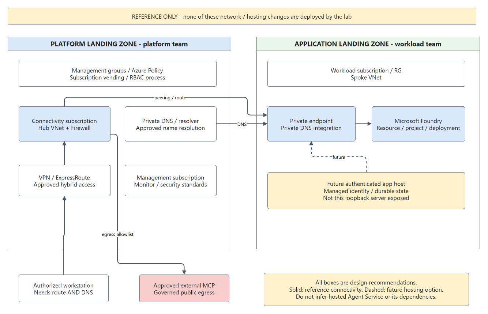

# Agent Harness: L400 Engineering Guide

**Audience:** engineers comfortable with async JavaScript, HTTP and distributed-system failure modes. **Scope:** the source in [agent-harness-workshop](https://github.com/ibranibeny/agent-harness-workshop), not an implementation claim about every agent framework. **Reviewed:** 15 September 2026.

The invariant is **proposal is not authority**. The model can propose an operation. Only the host's allowlist, schema validation, prepared arguments and exact approval decide whether it executes.

## 1. Ownership Map

| Module | Owns | Does not own |
|---|---|---|
| `src/config.mjs` | Participant configuration and endpoint validation | Provisioning or role assignment |
| `src/model.mjs` | Entra credential, identity guard, OpenAI protocol, pacing/retries | Tool execution or factual correctness |
| `src/harness.mjs` | Message loop, dispatch order, usage budget and terminal result | HTTP authorization or persistent session ownership |
| `src/tools.mjs` | Tool allowlist, strict local schemas, exact prepared approval | Arbitrary shell, arbitrary remote endpoints |
| `src/connectors.mjs` | MCP transports, timeout/cancellation and response validation | Model-level reasoning or approvals |
| `src/travel.mjs` | Dates, time zones, source URLs, PDF integrity, delivery contracts | Guaranteed forecasts or working production WorkIQ writes |
| `src/store.mjs` | Atomic JSON replacement and correlated conversation restore | Encryption, distributed locks or automatic recovery |
| `src/server.mjs` | Loopback HTTP, active run, approval promise, event persistence | Multi-user authorization |
| `public/app.js` | Run selection, conversation composer, trace replay | Trust decisions on model output |

## 2. Protocol: The Tool Result Is A New Observation

The OpenAI adapter uses Chat Completions with strict function definitions and `parallel_tool_calls: false`. It sends the deployment name, not a model catalog ID. The wrapper strips schema keywords unsupported by the model schema subset into descriptions, while the original strict Zod schema remains authoritative for local execution. That distinction is deliberate: compatibility is not permission to relax runtime validation.

The assistant proposes `{ id, type: 'function', function: { name, arguments } }`. The arguments are a JSON string. The host parses it, verifies that the name is allowed, validates the entire object, and only then performs an action. The observation has the following protocol shape:

```javascript
const observation = {
  role: 'tool',
  tool_call_id: call.id,
  content: JSON.stringify(result)
};
messages.push(observation);
```

The `tool_call_id` is the correlation key. Restoring a tool result as an unrelated user message changes the protocol and obscures provenance. A tool error is also an observation, not a reason to invent a successful result. The model can explain the limitation, correct its arguments or request clarification in another bounded iteration.

The harness defensively handles at most six calls in one model response, executing them sequentially. Serial tool dispatch does not mean predefined sequential multi-agent orchestration. There is one model-driven agent, not a planner agent delegating to researcher agents.

## 3. Loop And State Machine


| State | Meaning | Exit condition |
|---|---|---|
| `running` | Model request or tool work is in progress | Answer, approval, error, cancellation or limit |
| `awaiting_approval` | Exact prepared proposal waits on a human decision | Matching one-use approval ID, denial or abort |
| `completed` | Nonempty assistant response without calls accepted within limits | Terminal; may be a clarification or limitation |
| `limited` | Step or cumulative token budget reached | Terminal; not proof the task succeeded |
| `failed` | Runtime/adapter error prevented completion | Terminal; inspect error and last observations |
| `cancelled` | Abort signal stopped the execution | Terminal; remote work may have already occurred |
| `interrupted` | Startup found an unfinished prior run | Terminal; no automatic approval or action resume |

Completion accepts only adapter finish reasons `stop` and `tool_calls`. Truncated output is an error. A final answer is not proof of tool execution, artifact creation, factual accuracy or external delivery. Evaluate those outcomes independently.

Sequential Thinking is optional. All enabled tools are offered in the first request, with no forced `tool_choice`. Simple weather or attractions queries can search directly; missing details can produce an immediate clarifying answer. The actual local MCP server records at most eight public updates when selected. It does not search, verify facts, run the suggested `nextStep`, or authorize writes. Public summaries contain goals, constraints and observations, not private chain-of-thought.

## 4. Context, Persistence And Conversation Boundaries

Working context is current system instructions, validated restored history, current user prompt, and in-loop assistant/tool messages. It grows with observations. The implementation does not perform automatic summarization, compaction, semantic retrieval or vector-memory indexing.

A reply carries `parentRunId`. `readConversation` walks completed ancestors, identifies the conversation root and reconstructs user messages, assistant responses and exact call/result pairs. The maximum is 16 ancestors and 80,000 serialized history characters. Cycles, missing runs, invalid IDs, noncompleted parents and incomplete or duplicate tool pairings fail closed. Old system messages are not imported. Old tool results are retained as evidence but tools are not replayed.

The conversation ID is a linkage identifier, **not an authorization boundary**. This loopback single-user lab does not verify per-user ownership. Before hosting, map user-visible sessions to authenticated tenant/user ownership and enforce it on every read, continuation, download, approval and cancellation. Microsoft Learn's [session guidance](https://learn.microsoft.com/agent-framework/concepts/agents/conversations/session) explicitly warns against treating service conversation IDs as user authorization.

Preference memory is separate JSON state, exposed only when enabled. Reads require relevance; writes require exact approval. The local MCP's planning state is a third mechanism, fresh per execution. A recreated planning process does not erase persisted conversation history.

`writeJson` uses a temporary file and atomic replacement with bounded retry for transient Windows rename locks. Per-run events are persisted in order. This provides useful local evidence; it is not a multi-process transaction system. Startup marks unfinished runs interrupted rather than attempting unsafe recovery. There is no durable workflow checkpoint that can resume a suspended JavaScript promise.

## 5. Exact Human Approval

The tool registry prepares and validates a proposal before requesting approval. The server binds `{callId, name, args}` to a random approval ID and the active run. The browser previews those arguments. Only a matching decision resolves the pending one-use promise; stale IDs, other runs and repeated decisions are rejected.

Denial returns a structured observation without performing the write. Cancellation/timeout aborts the pending wait. History can contain the old proposal and denial, but cannot restore permission. A reply saying "approve" is ordinary text, not the approval API. The model cannot use planning as permission.

This is narrower than some framework configurations that support standing approvals. This lab intentionally does not implement "always approve," model-driven auto-approval or permission inherited from earlier turns. Compare [Microsoft Learn tool approval](https://learn.microsoft.com/agent-framework/agents/tools/tool-approval), while keeping this custom Node implementation's actual behavior distinct.

## 6. Identity, Network And Data Exposure

`AzureDeveloperCliCredential` is explicit and tenant-scoped. The application does not probe other identities through a default credential chain. It requests `https://ai.azure.com/.default`, decodes claims for a local account/tenant guard and lets Azure validate the actual token and permissions. Decoding claims alone is not cryptographic token validation.

The exported configuration rejects placeholder identity/deployment values before token acquisition and validates the commercial Azure OpenAI endpoint form. Metadata validation is not an Azure resource lookup. Doctor verifies identity, whereas a real inference call tests data-plane access. An Azure resource owner must grant appropriate inference permissions in advance; the application cannot do so.

Browser mutations require a local session token, permitted Host/Origin, JSON content type and bounded request body. Content Security Policy and safe text rendering reduce browser injection risk. The session token is a local anti-cross-origin control, not enterprise authentication. Do not publish the local server or `/api/state` response.

WebIQ uses the configured fixed MCP endpoint and an approved server-side key. It allows only `web`; its content is untrusted. Instructions embedded in research results must not override the system or grant tool permissions. Tools restrict filenames, dates, URLs and output sizes, but this is not a complete prompt-injection defense or data-loss-prevention system.

Local files remaining on the laptop does not mean local-only data processing: prompt text, restored history, tool results and retrieved memory are sent to Foundry. WebIQ receives search queries. Traces contain those observations. Use nonsensitive data and explicit retention rules. The application does not encrypt runtime files.

## 7. Budgets, Pacing And Failure Semantics

| Control | Value / behavior | Important limitation |
|---|---|---|
| Model iterations | Default 12; API accepts 1-16 | A tool call consumes a turn; another is needed to interpret results |
| Cumulative tokens | Default soft limit 100,000 | Checked after a response; usage may overshoot before stopping |
| Completion allowance | 2,200 tokens per model response | Part of request admission; not the total run budget |
| Run deadline | 15 minutes, including approval waits | Human delay can consume the entire deadline |
| SDK timeout/retries | 90 seconds; two retries | Retries add latency and possible usage |
| Model dispatch | Serialized; local pacing | Other processes and participants are not coordinated |
| WebIQ handshake/call | 20-second handshake, 60-second call, 80-second operation bound | Aborts are best effort across remote boundaries |
| Planning | At most eight MCP updates | More plan text consumes context and model turns |

The adapter estimates request size as `ceil((serialized messages + schemas).length / 3) + 2200`. Its request-spacing estimate is the larger of a request-rate interval plus 500 ms and the estimated-token interval. This is a coarse pacing heuristic, not a provider tokenizer or distributed quota reservation.

For the reference 50 RPM / 50,000 TPM configuration, a 25,000-token estimate yields a 30-second token-based interval. A different deployment must supply its own values. Increasing the 100,000 cumulative budget does not increase TPM, a model's context window, or the deployment's admission capacity. A request larger than what a deployment admits may keep failing despite waiting.

`model_request` is emitted before pacing and transport. It proves an iteration was prepared, not that Azure received it. `rate_wait` proves deliberate delay, not a 429. Use the actual response/request IDs, error and usage metadata for provider evidence. No token-cost estimate is presented as an invoice.

## 8. Artifact And Delivery Integrity

The travel schema validates real calendar dates, ordered date ranges, maximum duration, time-zone mapping, one day entry for each travel date, bounded text and HTTP(S) sources. PDFKit writes an A4 document only after approval, with exclusive per-run filenames, a size limit, byte count and SHA-256 hash. The companion itinerary JSON is used for later delivery preparation.

These controls establish local artifact consistency, not factual truth. A source URL is attribution, not automatic verification. The model must compare dates and source coverage. Weather search reports `forecastVerified: false` because retrieval alone has not validated a forecast.

Email/calendar tool contracts refer to that run's saved artifact and need separate recipient/attendee approval. The production WorkIQ write connector is not implemented in this snapshot. An editor's connected M365 tools do not authenticate this runtime. Tests inject controlled connectors to validate payload/approval contracts; that is not live mail or calendar evidence.

The delivery code records attempts before remote calls and blocks ambiguous resubmission. This is not an exactly-once guarantee: a crash between remote acceptance and local receipt persistence can still leave uncertainty. A production design needs operation IDs, idempotency support, reconciliation and audit ownership.

## 9. Landing Zone: From Lab To Governed Workload



The diagram is a design reference, not evidence of deployed resources. Apply [Cloud Adoption Framework landing-zone guidance](https://learn.microsoft.com/azure/cloud-adoption-framework/ready/landing-zone/) and the [Foundry landing-zone baseline](https://learn.microsoft.com/azure/architecture/ai-ml/architecture/baseline-microsoft-foundry-landing-zone) to your organization's requirements.

| Boundary | Platform responsibility | Workload responsibility |
|---|---|---|
| Identity | Tenant policies, privileged access, role-assignment process | Least-privilege runtime identity; per-user session authorization |
| Governance | Management groups, subscription vending, baseline Policy | Resource tags, data classification, budget and quota requests |
| Connectivity | Hub, approved hybrid path, Firewall, central private DNS | Spoke integration, endpoint dependencies and egress allowlist |
| Foundry | Regional and model governance; optional shared AI gateway | Resource/project/deployment ownership and inference configuration |
| Operations | Central monitoring and security collection standards | Redacted spans, SLOs, runbooks and evaluation gates |
| State | Approved storage/security patterns | Durable conversation/approval store, retention and recovery |

A local developer reaching private Foundry needs private DNS resolution and network line of sight through an approved VPN/ExpressRoute or equivalent access path. Creating a private endpoint without those dependencies breaks connectivity. Public MCP services still need an outbound policy; Private Link to Foundry does not privatize WebIQ.

A hosted extension could use a managed identity, authenticated API, scalable state store and controlled tool environment. The current Node server must not simply be exposed behind a public URL. Microsoft reference architectures may include App Service, Agent Service, Azure AI Search, Cosmos DB, Storage and Key Vault for different responsibilities. Choose what the actual design requires; do not describe these as installed lab components. Global deployment SKUs can process inference outside the resource region; confirm the chosen SKU's current residency guarantees before using regulated data.

## 10. Evaluation And Failure Injection

| Test / experiment | Expected evidence | Failure it catches |
|---|---|---|
| Direct weather/destination without planning | Search present in first request, no forced tool choice | Accidental mandatory planning regression |
| Malformed or extra arguments | Rejection before approval/execute | Schema drift or allowlist bypass |
| Deny export | Denied observation, missing output file | Write performed before decision |
| Replay wrong approval ID | HTTP 409, no action | Stale or cross-run permission reuse |
| Reply to completed draft | Paired prior observations, same conversation root | Lost context or action replay |
| Incomplete restored tool history | Explicit restoration failure | Protocol corruption |
| Max steps / token boundary | `limited`, no unauthorized follow-on action | Unbounded agent loop |
| Stalled MCP initialization | Abort propagated through deadline | Unbounded connector hang |
| Browser history race | Newer selection/draft preserved | Late response overwrites user work |
| Unavailable delivery | Explicit failure, no sent claim | Fabricated external side effects |

Production evaluation should also measure source correctness, tool-selection accuracy, task success, denial compliance, prompt-injection resilience, cost per successful task and p50/p95 latency across a fixed dataset. Compare optional planning against no planning on equivalent tasks; more planning events are not a quality metric. No automated Foundry evaluation suite or quality score is claimed here.

## 11. Evidence Ladder And Release Checklist

1. A prompt establishes intent.
2. `model_request` establishes prepared context and tool availability.
3. `model_response` establishes returned model output and reported usage.
4. `tool_call` establishes a proposal, not execution success.
5. `tool_result` establishes the observed response or error.
6. Approval events establish one decision for one proposal.
7. An artifact hash or provider receipt supports a specific action outcome.
8. Independent inspection establishes whether the user's actual objective was met.

Before release, require tests on the exact revision, live read-only integration evidence, independent artifact checks when writes are approved, per-user authorization, durable recovery semantics, secrets and log review, dependency scanning, capacity planning, deployment rollback and a human escalation path. This repository is an educational local harness, not a production-certified agent platform.

## References

- [AI agent orchestration patterns](https://learn.microsoft.com/azure/architecture/ai-ml/guide/ai-agent-design-patterns)
- [MCP client-server architecture](https://learn.microsoft.com/dotnet/ai/get-started-mcp#mcp-client-server-architecture)
- [Foundry MCP security practices](https://learn.microsoft.com/azure/foundry/agents/how-to/tools/model-context-protocol#best-practices)
- [Sessions and conversation state](https://learn.microsoft.com/agent-framework/concepts/agents/conversations/session)
- [Tool approval](https://learn.microsoft.com/agent-framework/agents/tools/tool-approval)
- [Azure landing zones](https://learn.microsoft.com/azure/cloud-adoption-framework/ready/landing-zone/)
- [Foundry in an Azure landing zone](https://learn.microsoft.com/azure/architecture/ai-ml/architecture/baseline-microsoft-foundry-landing-zone)
- [AzureDeveloperCliCredential for JavaScript](https://learn.microsoft.com/javascript/api/@azure/identity/azuredeveloperclicredential)

The material is an original explanation of this implementation. Learn's SDK examples and hosted-service diagrams are references, not code used by this Node runtime. The separate [Sequential Thinking reference server](https://github.com/modelcontextprotocol/servers/tree/main/src/sequentialthinking) is an optional third-party MCP dependency, not a Microsoft requirement.