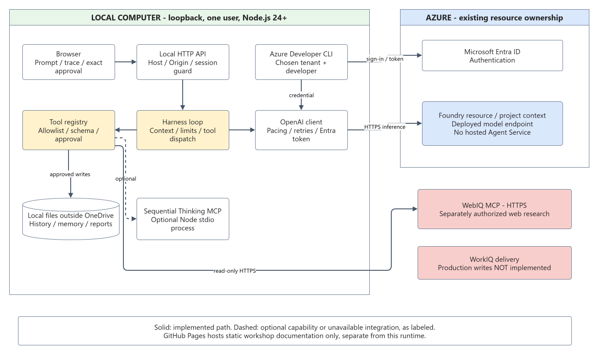
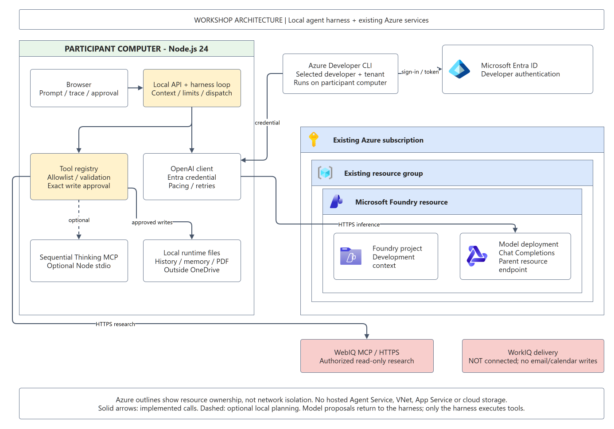
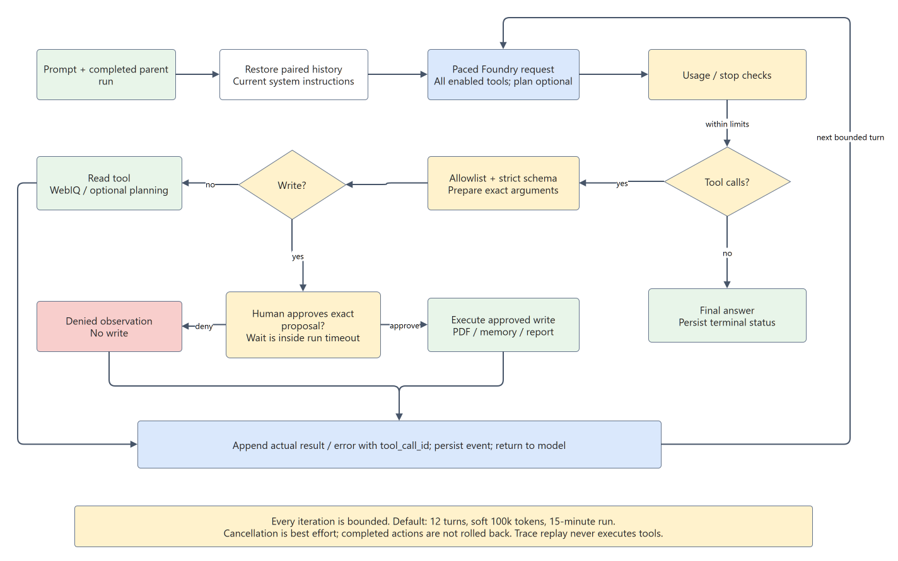

# Workshop: Understanding the Agent Harness

Build and inspect a local travel-planning agent that uses real Microsoft Foundry inference. This is a Windows / Node.js 24 workshop, not an offline demo and not a cloud-hosted Agent Service deployment.

**Audience:** developers and solution architects. **Duration:** 150 minutes, with an optional 60-minute L400 extension. **Reviewed:** 15 September 2026. The public source is [ibranibeny/agent-harness-workshop](https://github.com/ibranibeny/agent-harness-workshop).

## Recorded Walkthrough

This silent, real-time recording starts a new conversation at `http://127.0.0.1:4317/`, runs actual Foundry inference and WebIQ research, opens **Trace**, and continues to an exact PDF approval preview. The demonstration selects **Deny**. No PDF, memory, email or calendar write is approved. This is real execution, not simulated provider output.

<video id="lab-walkthrough" controls playsinline preload="metadata" width="1440" height="1000" style="width:100%;height:auto;aspect-ratio:36/25" poster="assets/walkthrough-poster.png">
	<source src="assets/lab-walkthrough.webm" type="video/webm">
	<track kind="captions" src="assets/walkthrough.vtt" srclang="en" label="English chapter captions">
	<a href="assets/lab-walkthrough.webm">Open the recorded walkthrough</a>.
</video>

Recorded 15 September 2026, approximately 5 minutes 36 seconds. Privacy overlays hide identity, local paths, saved-memory contents and prior-run content; the original lab is not reset. Chapter times are approximate. Captions describe the stages, and waits for the model remain visible. The recording browser used styling only for redaction; server code and approval checks were unchanged.

| Time | What to inspect |
|---|---|
| [00:00](assets/lab-walkthrough.webm#t=0) | New conversation, prompt, memory disabled and eight-step limit |
| [01:50](assets/lab-walkthrough.webm#t=110) | Trace: actual WebIQ calls and returned observations |
| [02:11](assets/lab-walkthrough.webm#t=131) | Model response, request ID and actual token usage |
| [02:25](assets/lab-walkthrough.webm#t=145) | Continue the same conversation without repeating research |
| [03:51](assets/lab-walkthrough.webm#t=231) | PDF arguments and the `approval_requested` event |
| [04:27](assets/lab-walkthrough.webm#t=267) | Deny the exact write proposal |
| [04:47](assets/lab-walkthrough.webm#t=287) | `denied: true`, final response, and no PDF (`404`) |

[Download the redacted execution trace](walkthrough-trace.json) for both demonstration runs. The research run completed with five model responses and 47,746 tokens; its continuation used two responses and 35,553 tokens. Trace playback itself makes no inference calls. Source results and weather caveats remain observations, not independent verification of every travel claim.

## 1. Learning Outcomes

By the end, you should be able to explain why an agent needs a loop, distinguish a model's proposal from permission to act, trace a real MCP result back to its call, continue a conversation without re-executing old actions, and identify the boundary between a local lab and an Azure landing zone.

| Time | Exercise | Observable outcome |
|---|---|---|
| 0-20 min | Overview and architecture | Explain model, harness, tools, state and approval |
| 20-50 min | Clone, configure, test and start | Local dashboard and verified developer identity |
| 50-75 min | Direct destination and weather research | WebIQ observations and cited, date-aware answer |
| 75-105 min | Itinerary, continuation and approval | Exact PDF proposal; deny or explicitly approve |
| 105-125 min | Memory, limits and trace | Distinguish preference memory from conversation history |
| 125-150 min | Landing zone and debrief | Name production gaps and responsible teams |

## 2. Overview: Model, Agent, Harness And MCP

An LLM generates text and structured tool-call proposals. An **agent** combines model decisions with capabilities and state. The **harness** is the application code around the model: it assembles context, advertises allowed tools, validates arguments, runs approved actions, returns observations, persists evidence and stops execution at configured limits.

Microsoft Learn recommends starting with the lowest sufficient orchestration complexity. A single agent with multiple tools often solves a cohesive problem without the latency and coordination cost of multiple agents. This lab implements that pattern in JavaScript. It does **not** use the Microsoft Agent Framework SDK; the Learn concepts guide its design, not its package selection. See [AI agent orchestration patterns](https://learn.microsoft.com/azure/architecture/ai-ml/guide/ai-agent-design-patterns).

**Model Context Protocol (MCP)** standardizes communication with tool servers. It does not decide whether a tool is safe, whether the caller has permission, or whether returned content is true. The harness retains those responsibilities. Read the language-independent [MCP client-server architecture](https://learn.microsoft.com/dotnet/ai/get-started-mcp#mcp-client-server-architecture) and [Foundry MCP security practices](https://learn.microsoft.com/azure/foundry/agents/how-to/tools/model-context-protocol#best-practices). The .NET article supplies protocol concepts only; this lab uses Node.js.

| Element | Job in this lab | What it is not |
|---|---|---|
| Foundry model | Choose calls, interpret observations, answer | A local executor or approval authority |
| Node harness loop | Dispatch, limits, cancellation, context | A second LLM |
| WebIQ MCP | External web research | A guaranteed exact-date forecast |
| Sequential Thinking MCP | Optional public plan/status record | Web search, private chain-of-thought, or a prerequisite |
| Conversation history | Retain earlier messages and paired observations | Permission to replay a previous action |
| Preference memory | Store explicitly approved reusable preferences | A transcript, vector store or automatic summarizer |
| Human approval | Authorize one exact prepared write | Blanket permission from chat text |

## 3. Scenario: A Singapore Museum Weekend

The traveler wants a relaxed two-day visit, source-backed attractions, weather appropriate to the travel dates, and an itinerary PDF. Email and calendar are later integration exercises, **not working production connectors in this lab**.

Use nonsensitive workshop data. The sample dates are 19-20 September 2026 in `Asia/Singapore`; change them when running the workshop later. A search result's existence does not establish a forecast for those dates. When no reliable dated forecast is available, the answer must say so and distinguish seasonal climate from forecast evidence.

### Current Lab Architecture



Download the editable [three-page draw.io file](harness.drawio). Page 1 is the local application design; page 2 shows the workshop's Azure services and connection boundaries; page 3 is the execution flow.

| Component | Location and role | Required for this lab? |
|---|---|---|
| Browser, HTTP API, harness, PDFKit | Local computer; loopback listener | Yes |
| Microsoft Entra ID | Azure developer authentication; selected tenant/account | Yes |
| Azure subscription and resource group | Resource ownership and management boundary | Existing resources only |
| Microsoft Foundry resource | Hosts a compatible deployed model | Yes |
| Foundry project | Organizes AI development; the code uses the parent resource's model endpoint | Existing project context; not a hosted-agent runtime |
| Model deployment | Chat Completions with strict function tools | Yes; deployment name is not the model family name |
| WebIQ MCP | Remote service reached over HTTPS | Required for travel research; separately authorized access |
| Sequential Thinking MCP | Local Node subprocess, started only if selected | Optional |
| JSON memory, traces, reports | Local application data directory outside OneDrive | Yes; not application-encrypted |
| WorkIQ / Microsoft 365 | Planned delivery boundary | Unavailable; no working email/calendar writes |
| App Service, VNet, Firewall, Private Link | Possible production design components | Not provisioned by this workshop |

### Workshop Architecture



The harness runs on the participant's computer. An existing **Azure subscription and resource group** own the **Microsoft Foundry resource**, its **project**, and a compatible **model deployment**. The project provides development context; the OpenAI client calls the parent resource's model endpoint directly. This is not a hosted Foundry Agent Service deployment.

**Microsoft Entra ID** authenticates the selected developer through Azure Developer CLI. The local client uses that credential for HTTPS inference. The harness, not the model service, validates and executes tool calls: remote WebIQ MCP performs authorized read-only research, optional Sequential Thinking runs as a local Node subprocess, and approved files stay in the local runtime directory outside OneDrive.

Azure components use unmodified [official Azure architecture icons](https://learn.microsoft.com/azure/architecture/icons/) (V24) and [Microsoft Entra architecture icons](https://learn.microsoft.com/entra/architecture/architecture-icons) (October 2023), under their documentation and training terms. Neutral shapes represent local code and external connectors. Subscription and resource-group outlines indicate ownership, not network isolation. No VNet, Firewall, Private Link, App Service or cloud storage is provisioned by this workshop. WorkIQ email/calendar writes remain unavailable. See the [L400 guide](L400.md) for the separate enterprise landing-zone extension.

## 4. The Agentic Workflow



1. The user submits a goal, step limit and memory setting. A reply can reference a completed parent run.
2. The server restores bounded, validated conversation history. The current system instructions are always first.
3. The harness sends messages and all enabled tool definitions to the real Foundry model. Planning is optional from the first iteration.
4. The model proposes a tool call or returns a final answer. A proposed `nextStep` inside a plan does not execute that step.
5. The registry checks the allowlist and strict local schemas. Read-only research goes to the configured WebIQ MCP `web` operation.
6. A write proposal is prepared and paused for exact human approval. Denial produces a tool observation without the write.
7. The result or error is appended with the original `tool_call_id`. The next model call sees what actually happened.
8. A nonempty final message ends the run, or a step/token/time/cancellation limit stops it. Trace replay never runs tools.

The loop is necessary because the model cannot interpret a tool result before the application obtains it. A tool call therefore commonly requires another model call. The loop is not an invitation to run indefinitely.

## 5. Local Deployment: Clone To Running App

### Step 0: Prepare The Computer

Required: Windows PowerShell, Git, Node.js 24+, npm, Azure Developer CLI (`azd`), a browser and access to an existing compatible Foundry deployment. GitHub CLI is needed only to publish, not to participate. The commands use neither Python nor the Azure CLI `az`.

```powershell
node --version
npm.cmd --version
git --version
Get-Command azd
```

Ask the instructor for your permitted tenant, user account, resource endpoint, deployment name and observed RPM/TPM limits. The instructor must arrange inference permissions and sufficient quota ahead of time. This repository does not create resources or assign roles. WebIQ access is a separate prerequisite; do not assume it is a generally available public service.

### Step 1: Clone The Public Source

```powershell
$labRoot = Join-Path $env:LOCALAPPDATA 'AgentHarnessWorkshopSource'
New-Item -ItemType Directory -Force $labRoot | Out-Null
Set-Location $labRoot
git clone https://github.com/ibranibeny/agent-harness-workshop.git
Set-Location agent-harness-workshop
git rev-parse --short HEAD
```

**Check:** the clone has `package.json`, `package-lock.json`, `src`, `public`, `tests` and `docs`. Use a new directory if the destination already exists; do not overwrite another clone. Record the revision in your workshop notes.

### Step 2: Install The Locked Dependencies

```powershell
npm.cmd ci --ignore-scripts
```

**Check:** exit code 0 and installed dependencies. This command uses the committed lockfile and does not execute package lifecycle scripts. Do not replace it with an unpinned upgrade during the workshop.

### Step 3: Configure Your Own Deployment

```powershell
Copy-Item .env.example .env
notepad.exe .env
```

Set these values in the local file, using values supplied by the instructor:

```dotenv
FOUNDRY_TENANT_ID=YOUR-TENANT-GUID
FOUNDRY_ACCOUNT=YOUR-ALLOWED-SIGN-IN-ACCOUNT
FOUNDRY_BASE_URL=https://YOUR-RESOURCE.openai.azure.com/openai/v1/
FOUNDRY_DEPLOYMENT=YOUR-DEPLOYMENT-NAME
FOUNDRY_RPM=50
FOUNDRY_TPM=50000
PORT=4317
```

RPM/TPM above are example values, not capacity reservations or a promise of availability. Replace them with your deployment's limits. The public client validates the commercial Azure OpenAI endpoint form shown here; other clouds and endpoint families require a deliberate adapter change. Never put an API key into this file for Foundry: the application uses Entra authentication. Do not paste passwords or tokens into chat.

```powershell
node --env-file=.env --input-type=module -e "import { validateConfiguration } from './src/config.mjs'; validateConfiguration(); console.log('Configuration valid; values not printed.');"
git check-ignore .env
```

**Check:** configuration validation succeeds and `.env` is ignored. This is syntax/configuration validation, not a resource existence, permission or inference check.

For WebIQ, arrange an authorized `WebIQ-MCP` server entry in the VS Code user MCP configuration through your instructor. The connector expects `https://api.microsoft.ai/v3/mcp`, a server-side `x-apikey`, and the `web` tool. Never commit that configuration. Missing access fails explicitly; there is no mock provider fallback.

### Step 4: Authenticate And Run Doctor

Sign in yourself in the browser, selecting the account and tenant configured above:

```powershell
azd auth login --tenant-id YOUR-TENANT-GUID
npm.cmd run doctor
```

**Check:** doctor reports `identity_verified` for your configured tenant and account. Its output contains identity and endpoint metadata: do not publish it unredacted. The screenshot evidence uses an existing authorized session rather than re-enacting sign-in. Doctor obtains an Entra token and checks identity; it does **not** call the LLM or prove inference permission.

Authentication reference: [AzureDeveloperCliCredential for JavaScript](https://learn.microsoft.com/javascript/api/@azure/identity/azuredeveloperclicredential).

### Step 5: Run The Deterministic Tests

```powershell
npm.cmd test
```

**Check:** all tests pass. These tests use temporary files, real local Sequential Thinking MCP where applicable, and controlled model/connector objects for deterministic boundaries. They are not evidence of live Foundry or WebIQ availability.

The optional additional smoke test makes **billable** real Foundry calls:

```powershell
npm.cmd run test:live
```

**Check:** a local arithmetic tool returns 42 and the real model uses the observation. It tests inference and tool continuation, not travel-source quality or email delivery.

### Step 6: Start The Local Server

```powershell
npm.cmd start
```

Open the loopback URL printed by the server, normally `http://127.0.0.1:4317`. If occupied, the server tries the next port. An absent `.env` message is harmless only when configuration was supplied through environment variables; a missing configuration will fail authentication explicitly.

**Check:** the dashboard loads and Runtime shows planning as **optional**. The exported copy uses `%LOCALAPPDATA%\AgentHarnessWorkshop` for runtime data by default. `HARNESS_DATA_DIR` can select another local directory. Never run two servers against the same runtime directory. Stop your own server with `Ctrl+C`; do not expose its port beyond loopback.

### Screenshot Evidence

The [execution evidence section](index.html#evidence) contains screenshots for prerequisite checks, clone, install, configuration, doctor, tests, startup and the application workflow. Command screenshots are **an evidence viewer rendering captured process output**, not screenshots of a simulated terminal. Identity values and user paths are redacted. Every capture states what it proves and what it does not prove.

Verification used public source revision `5dca404`, Node.js 24.16.0, and a separately authorized `gpt-5.6-sol` deployment. All 23 deterministic tests and the live arithmetic test passed on the fresh clone. An earlier staging run hit a transient Windows `EPERM` rename lock; the isolated test and later full runs passed without a code change. The capture helper also required a Windows quoting correction before configuration verification. These preparation issues are not presented as application successes.

The travel run made real WebIQ calls and completed in five model responses using 33,749 reported tokens. One initial `search_destination` proposal exceeded the local 300-character `interests` limit and was rejected; the model corrected it before successful research. Exact-date forecast coverage remained unverified. Generated travel text is an observed model answer, not independently certified travel advice.

## 6. Lab A: Direct Research

Start **New conversation**, turn preference memory off, and submit:

> Find two museums in Singapore using official sources. Use WebIQ destination research and cite the URLs. Keep the answer short. Do not export, save preferences, email or create calendar events.

Inspect the first `model_request`. `search_destination` and `search_weather` should already be available and `planningRequired` should be false. Simple research can reach WebIQ directly; planning remains a model choice, not a required gate.

Then ask about weather with explicit dates. Confirm the actual `search_weather` arguments and inspect whether the sources cover those dates. Do not treat `forecastVerified: false` as a verified forecast. Look for source timestamps, geographical coverage and honest uncertainty.

**Pass:** a real WebIQ observation and an answer grounded in its URLs. **Not enough:** a fluent answer, a `tool_call` event without a result, or a planning summary saying research was performed.

## 7. Lab B: Itinerary And Approval

Start a new conversation with the travel preset, edit the dates and request a concise itinerary. Inspect destination/weather observations before trusting the draft. A full itinerary may use optional planning and multiple iterations.

For a completed draft, send a reply in the **same conversation**:

> Use the reviewed itinerary already in this conversation. Submit it to export_itinerary_pdf for the exact approval preview. Do not research again, save preferences, email or create calendar events.

Review the proposed dates, time zone, daily plan, weather caveat and sources. The model must actually call `export_itinerary_pdf` before an approval panel exists. Text saying "I can export after approval" is not itself a pending tool request.

Choose **Deny** first. Confirm a denied observation and no new PDF. For a new proposal, the participant may choose **Approve** after review. Only a successful `saved: true` result, file bytes and SHA-256 support a claim that the PDF was written. The **Itinerary PDF** link appears after a successful write.

Each proposal needs its own decision. Chat text saying "approved" and earlier approvals do not authorize a new call. Approval is not a guarantee that travel facts are correct. See [Microsoft Learn tool approval](https://learn.microsoft.com/agent-framework/agents/tools/tool-approval).

## 8. Lab C: Memory, History And Limits

Use the preference-memory scenario to propose a nonsensitive preference, such as "prefer museums and public transport." Inspect and approve the exact memory write yourself. In a new conversation, allow memory and ask for a plan consistent with that preference.

**Conversation history** restores a prior draft and paired observations when replying to a completed run. **Preference memory** stores selected reusable facts. **Planning state** records public updates within one execution. These are three different mechanisms. A new conversation does not inherit the previous transcript. Disabling preference memory does not erase conversation history. See [Microsoft Learn sessions](https://learn.microsoft.com/agent-framework/concepts/agents/conversations/session).

Repeat a read-only task with max steps set to 1. A tool result may be captured but no model turn remains to interpret it. `limited` is not the same as a completed answer. The default cumulative soft token budget is 100,000; it is not a context-window limit or tokens-per-minute quota.

## 9. Troubleshooting

| Symptom | What to inspect | Safe next action |
|---|---|---|
| Configuration error | `.env` presence and required values | Correct local metadata; never paste secrets |
| Wrong identity / tenant | Doctor output versus your chosen account | Sign in yourself to the configured tenant |
| 401 / 403 from Foundry | Endpoint, data-plane permission, selected tenant | Ask the resource owner; do not grant yourself broad roles |
| WebIQ unavailable | Authorized server config and actual MCP result | Resolve access with the instructor; no synthetic research |
| 429 or quota pacing | Request size, RPM/TPM and concurrent users | Reduce context/output or coordinate workshop capacity |
| Tool loop stops early | Steps, tokens, timeout and last observation | Correct the task or start a bounded new run |
| No approval panel | Was a write tool actually proposed? | Reply to the completed draft and request the preview |
| Follow-up lacks draft | Selected parent is completed and history fits limits | Use the right completed run; new conversation is isolated |
| Server restarted during approval | Run marked interrupted | Start a new proposal; do not replay old permission |
| Email/calendar unavailable | No production write connector | Keep the PDF local; do not claim delivery |

## 10. Exit Criteria And Cleanup

You can explain one real trace from request through observation and answer, distinguish recorded evidence from intent, deny an action without a write, and identify which landing-zone components are only recommendations. Read the [L400 guide](L400.md) for protocol and production tradeoffs.

Stop your lab process. Keep or delete your own local runtime according to your organization's retention policy; it contains prompts and tool results. Do not delete another participant's runtime. No Azure resources were provisioned by these steps, so there is no infrastructure teardown command. Inference usage already incurred remains billable.